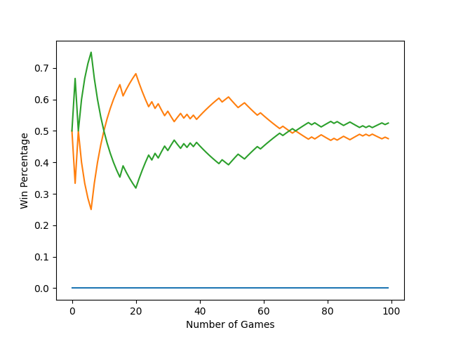
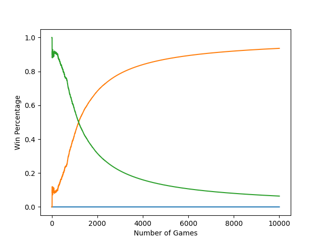

# Tic-Tac-Toe_AI  
An implementation of a tic-tac-toe solver using various AI and Machine Learning algorithms.  
  
### Usage  
```  
python3 Main.py  
```  
  
# Currently Implemented Models  
1. [Monte Carlo Tree Search (MCTS)](https://github.com/ZktAk/Tic-Tac-Toe_AI/tree/main?tab=readme-ov-file#mcts-vs-q-table)  
2. [Tabular Q-Learning](https://github.com/ZktAk/Tic-Tac-Toe_AI/tree/main?tab=readme-ov-file#q-table-vs-optimal)
3. [Random](https://github.com/ZktAk/Tic-Tac-Toe_AI/tree/main?tab=readme-ov-file#random-vs-optimal)  
4. [Optimized (manually programmed to always play best moves)](https://xkcd.com/832/) 
  
# Planned Models   
1. Neural Network  
2. Convelutional Neural Network + MCTS  
  
  
# Test Results  
  
### MCTS vs Optimal
  
"Monte Carlo is a heuristic. With a heuristic, we are not guaranteed precisely the correct or the best answer, but we can get an approximation that can often be good enough" [nestedsoftware](https://nestedsoftware.com/2019/08/07/tic-tac-toe-with-mcts-2h5k.152104.html).  
  
The following graph shows the Win, Loss, and Draw percentages over 100 training games of a **MCTS** model, configured with a 20 playout per move sampling rate, playing against an **Optimal Agent**.  
  
    
MCTS Win Percentage: 0.00%     
MCTS Loss Percentage: 52.48%     
MCTS Draw Percentage: 47.53%  
***  
**Q-Table vs Optimal**  
  
The following graph shows the Win, Loss, and Draw percentages over 10,000 training games of a standard **Tabular Q-Learning** model playing against an **Optimal Agent**.  
  
    
Q-Table Win Percentage: 0.00%      
Q-Table Loss Percentage: 6.40%       
Q-Table Draw Percentage: 93.60%  
***  
**Random vs Optimal**  
  
The following graph shows the Win, Loss, and Draw percentages over 10,000 training games of a **Random** agent playing against an **Optimal Agent**.  
  
    
Q-Table Win Percentage: 0.00%      
Q-Table Loss Percentage: 91.11%       
Q-Table Draw Percentage: 8.89%
