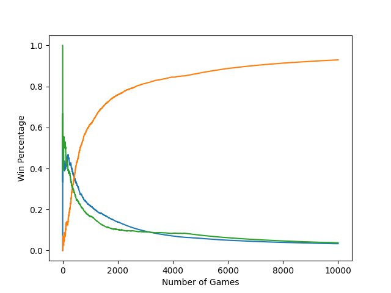

# Tic-Tac-Toe_AI
An implementation of a tic-tac-toe solver using various AI and Machine Learning algorithms.

### Usage
```
python3 Main.py
```

# Currently Implemented Models
1. Random
2. Optimized (manually programmed to always play best moves)
2. Tabular Q-Learning
3. Monte Carlo Tree Search (MCTS)

# Planned Models 
1. Neural Network
2. Convelutional Neural Network + MCTS


# Test Results

**MCTS vs Q-Table**

"Monte Carlo is a heuristic. With a heuristic, we are not guaranteed precisely the correct or the best answer, but we can get an approximation that can often be good enough" [nestedsoftware](https://nestedsoftware.com/2019/08/07/tic-tac-toe-with-mcts-2h5k.152104.html).

The following graph shows the Win, Loss, and Draw percentages over 10,000 training games of a standard **Tabular Q-Learning** model and an **MCTS** model, configured with a 20 playout per move sampling rate, playing against each other. (The graph is from the perspective of the Q-Table agent)

  
Final Win Percentage (Blue): 27.57%  
Final Loss Percentage (Green): 1.78%  
Final Draw Percentage (Orange): 70.65%
***
**Q-Table vs Q-Table**

The following graph shows the Win, Loss, and Draw percentages over 10,000 training games of two **Tabular Q-Learning** models playing against each other.

  
Final Win Percentage (Blue): 3.33%  
Final Loss Percentage (Green): 3.74%  
Final Draw Percentage (Orange): 92.93%

