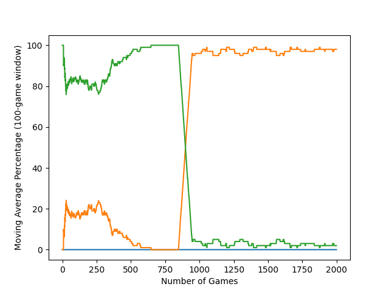
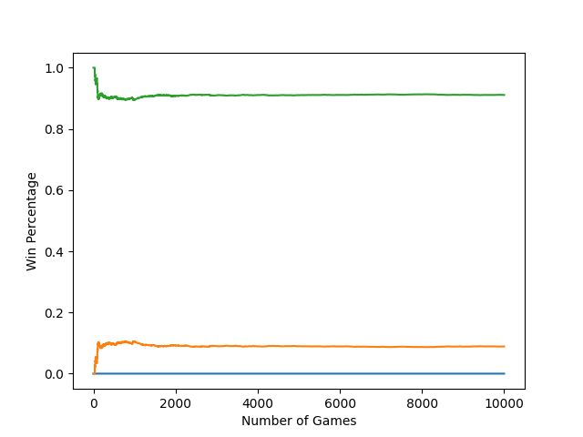

# Tic-Tac-Toe_AI  
An implementation of a tic-tac-toe solver using various AI and Machine Learning algorithms.  
  
### Usage  
```  
python3 main.py  
```  
  
# Currently Implemented Models  
1. [Neural Network (work in progress)](#neural-network-vs-optimal)
2. [Monte Carlo Tree Search (MCTS)](#mcts-vs-optimal)  
3. [Tabular Q-Learning](#q-table-vs-optimal)
4. [Random](#random-vs-optimal)  
5. [Optimized (manually programmed to always play best moves)](https://xkcd.com/832/) 
  
# Planned Models
1. Convelutional Neural Network + MCTS  
  
  
# Test Results  

### Neural Network vs Optimal
  
 
The following graph shows the moving average win/draw/loss percentages over 2,000 non-randomized training games of a **Neural Network** (NN) model playing against an **Optimal Agent**. In this case, "non-randomized" means that the neural network (NN) always plays as X. For some reason, the NN does not currently learn when playing as O. This issue is actively being investigated. 

This graph uses a moving average interval of 100 games. 
    

Accuracy (last 100 games):      
NN Win Percentage: 0.0%      
NN Draw Percentage: 98.0%      
NN Loss Percentage: 2.0% 
***    
### MCTS vs Optimal
  
 
The following graph shows the cumulative win/draw/loss percentages over 100 randomized training games of a **MCTS** model, configured with a 1000 playout per move sampling rate, playing against an **Optimal Agent**. After much testing, 5000 playouts per move seemed to be close to the ideal configuration for maximizing model performance.  
  
   

Accuracy (cumulative):      
MCTS Win Percentage: 0.0%      
MCTS Draw Percentage: 96.0%      
MCTS Loss Percentage: 4.0% 
***  
### Q-Table vs Optimal  
  
The following graph shows the moving average win/draw/loss percentages over 1,000 randomized training games of a standard **Tabular Q-Learning** model playing against an **Optimal Agent**. 
  
This graph uses a moving average interval of 100 games.
  

Accuracy (last 100 games):      
Q-Table Win Percentage: 0.0%      
Q-Table Draw Percentage: 100.0%      
Q-Table Loss Percentage: 0.0% 
***  
### Random vs Optimal  
  
The following graph shows the cumulative win/draw/loss percentages over 10,000 randomized training games of a **Random** agent playing against an **Optimal Agent**.  
  


Accuracy (cumulative):      
Random Win Percentage: 0.0%      
Random Draw Percentage: 8.6%      
Random Loss Percentage: 91.4%
