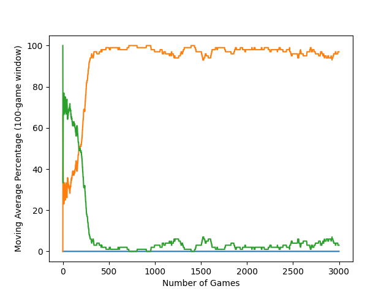
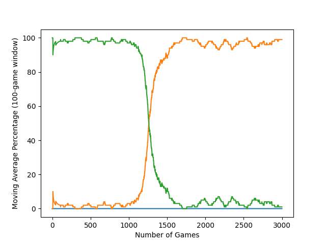
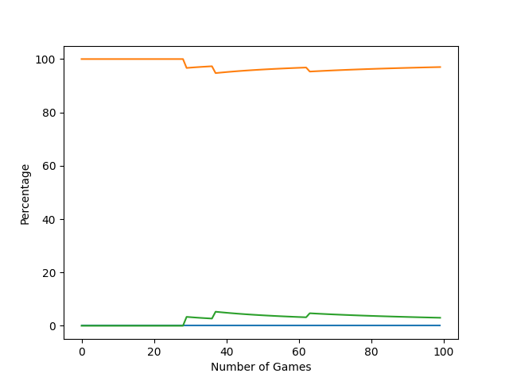
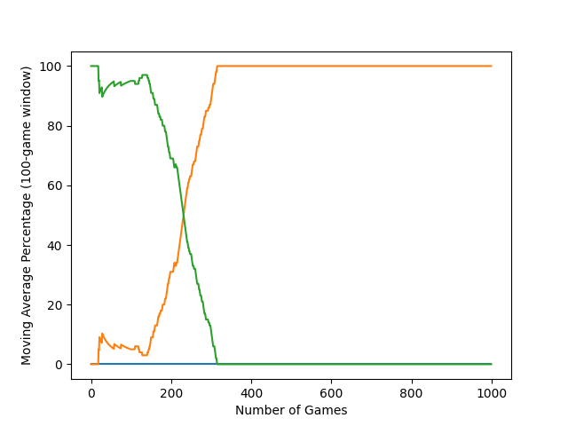
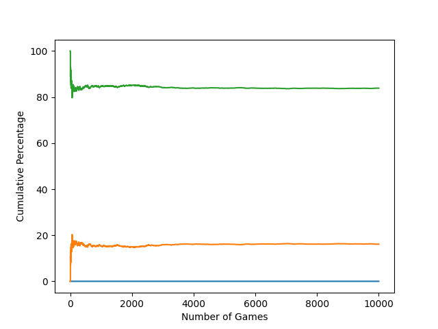
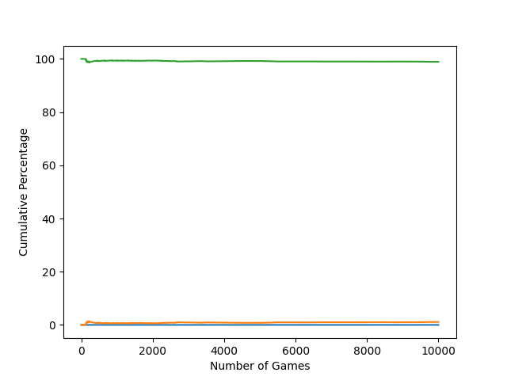

# Zeta-T3

Dive into Zeta-T3, a raw Python showdown where AI agents battle it out on the 3x3 Tic-Tac-Toe grid! 
“Zeta” is our fearless AI pioneer, and “T3” marks the classic 3x3 board, a solved game where draws 
reign supreme. From a scrappy neural net swapping X and O strategies to a Q-Learning champ hitting 
100% draws, and an MCTS strategist simulating thousands of games, Zeta-T3 pits these agents against 
a flawless Optimal foe, scoring ~96–100% draw rates. Built without fancy libraries like pytorch or 
tensorflow, but pure code and grit, this arena tests RL smarts in a perfect playground. It’s the 
first strike in the Zeta saga, with Zeta-T9, Zeta-Check, and Zeta-Knight planned for ultimate tic tac 
toe, checkers, and chess, respectively. Ready to see AI rise? Game on!

---

This project implements Tic-Tac-Toe solvers using various AI and 
machine learning algorithms. Tic-Tac-Toe is a solved game: X moves 
first, and perfect play by both players results in a draw, making 
draws the optimal outcome against a perfect opponent. Its solved 
nature provides a controlled environment for evaluating AI 
strategies. The project tests agents like Neural Networks, Monte 
Carlo Tree Search (MCTS), and Q-Learning against an Optimal Agent 
that executes flawless moves, as referenced in [XKCD #832](https://xkcd.com/832/).
The codebase exists to analyze algorithmic performance in a simple, 
fully understood game.

### Execution  
To run the project:
```  
python src/main.py
```  

This executes Tic-Tac-Toe games, comparing AI agents to the Optimal 
Agent, and generates graphs in the graphs/ directory. Requires 
Python 3.8+ and libraries: numpy, matplotlib, pickle. Install with:

```
pip install numpy matplotlib
```

# Implemented Agents  
1. [Neural Network (work in progress)](#neural-network-vs-optimal): A reinforcement learning model using a neural network to estimate move values from bitboard states. Functional as X, but underperforms as O, likely due to state encoding or reward issues. Under review.
2. [Monte Carlo Tree Search (MCTS)](#mcts-vs-optimal): Simulates thousands of games to select moves. Uses 1,000 playouts per move; tests indicate 5,000 playouts optimize performance within computational limits.
3. [Tabular Q-Learning](#q-table-vs-optimal): Tabular Q-Learning: Builds a Q-table via reinforcement learning to map states to actions. Learns through repeated games and reward updates.
4. [Random Agent](#random-vs-optimal): Selects moves randomly. Included as a baseline for comparison.
5. Optimal Agent: Executes perfect moves, guaranteeing a draw or win. Based on [XKCD #832](https://xkcd.com/832/). 
  
# Planned Additions
1. Convolutional Neural Network + MCTS: A hybrid combining CNN state evaluation with MCTS decision-making.  
  
  
# Results  

Agents were tested against the Optimal Agent, which enforces a draw or win due to Tic-Tac-Toe’s solved status. High draw rates indicate performance close to optimal. Graphs display win/draw/loss percentages, either cumulative or moving average, across games.

### Neural Network vs Optimal
  
 
The Neural Network ran 3,000 games as X against the Optimal Agent, non-randomized. The moving average (100-game window) graph tracks performance.   

    

Accuracy (last 100 games):      
NN Win Percentage: 0.0%      
NN Draw Percentage: 97.0%      
NN Loss Percentage: 3.0%  

The Neural Network was then ran another 3,000 games, but this time as O against the Optimal Agent, non-randomized. The moving average (100-game window) graph tracks performance.   

    

Accuracy (last 100 games):      
NN Win Percentage: 0.0%      
NN Draw Percentage: 99.0%      
NN Loss Percentage: 1.0%  

Random seeds where tested until one was found that led to good training of the NN for both pieces. And although the NN still does not learn with randomized play even with this seed, the current implementation could be configured to have two separate neural networks to handle each piece. We could train separate weights (weights_x.pkl for X, weights_o.pkl for O) and load the right one based on the piece. Regardless, the current implementation proves the concept: a raw Python NN can learn Tic-Tac-Toe strategies from scratch, hitting ~97–99% draw rates against a perfect opponent. This is sufficient for now. 

What’s Next?

Porting to PyTorch or TensorFlow for faster training and maybe tackling randomized play. For now, this showcase shows what raw Python RL can do.

***    
### MCTS vs Optimal
  
 
MCTS played 100 randomized games (X or O) against the Optimal Agent, using 1,000 playouts per move. Tests suggest 5,000 playouts improve outcomes. The cumulative graph shows results.  
  
   

Accuracy (cumulative):      
MCTS Win Percentage: 0.0%      
MCTS Draw Percentage: 96.0%      
MCTS Loss Percentage: 4.0%   

The 96% draw rate indicates MCTS closely mimics optimal play in a solved game. The 4% losses occur seldom, reducible with additional playouts.
***  
### Q-Table vs Optimal  
  
Q-Learning completed 1,000 randomized games, updating its Q-table through rewards. The moving average (100-game window) graph tracks progress.

  

Accuracy (last 100 games):      
Q-Table Win Percentage: 0.0%      
Q-Table Draw Percentage: 100.0%      
Q-Table Loss Percentage: 0.0%  

The 100% draw rate confirms Q-Learning has derived an optimal policy for Tic-Tac-Toe, matching the solved game’s outcome. Effective for small state spaces.
***  
### Random vs Optimal  
  
To establish a performance baseline, the Random agent played 20,000 games against the Optimal agent—10,000 as X (first mover) and 10,000 as O (second mover). The Random agent selected moves without strategy or foresight, purely by chance. Since Tic-Tac-Toe is a solved game, the Optimal agent always forced a win or draw as expected. The purpose of this test was not to evaluate the Optimal agent but to quantify just how dire the outcomes are for an untrained agent starting from scratch.

These results are not only a benchmark but a stark illustration of the magnitude of difficulty involved in learning to play competently from a random policy—especially when playing as O.

---

Cumulative win/draw/loss percentages for 10,000 games where the Random agent played as X.


Accuracy (cumulative):      
Random Win Percentage: 0.0%      
Random Draw Percentage: 16.1%      
Random Loss Percentage: 83.9%    

Even with the first-move advantage, the Random agent only managed to draw in just 16.1% of games—chance events where the Optimal agent could not secure a win. The remaining 83.9% were clean losses, emphasizing that without strategy, even the starting player is overwhelmingly likely to lose.

-----
    
Cumulative win/draw/loss percentages for 10,000 games where the Random agent played as X.


Accuracy (cumulative):      
Random Win Percentage: 0.0%      
Random Draw Percentage: 1.1%      
Random Loss Percentage: 98.9%

The outlook is even bleaker as O. The Random agent drew only 1.1% of games—a mere 1 in 100—and lost virtually all others. This lopsided performance reveals a critical obstacle:

`
Agents beginning their training as O, with no prior knowledge, are almost guaranteed to fail.
`

Such an unforgiving environment provides almost no useful feedback for learning. The agent receives no signal that its moves are improving, because they almost never lead to better outcomes. This makes the learning curve steep and slow—especially in early training epochs—unless alternative strategies like brute-forcing, state abstraction, or experience replay are employed.