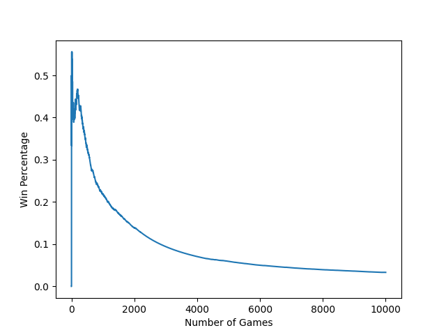
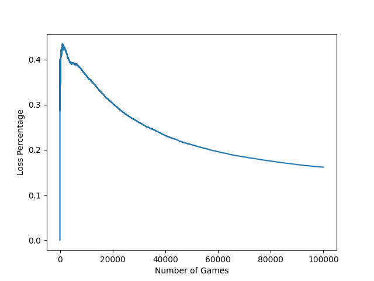
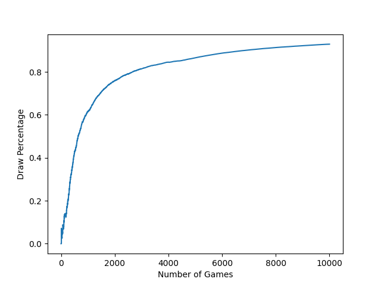

# Tic-Tac-Toe_AI
An implementation of a tic-tac-toe solver using various AI and Machine Learning algorithms.

### Usage
```
python3 Main.py
```

# Currently Implemented Models
1. Random
2. Tabular Q-Learning

# Planned Models
1. Monte Carlo Tree Search (MCTS)
2. Neural Network
3. Convelutional Neural Network + MCTS


# Test Results


The following graphs show the Win, Loss, and Draw percentages over 100,000 games of the Tabular Q-Learning model playing against the Random model.





Final Win Percentage: 0.73213%  
Final Loss Percentage: 0.16164%  
Final Draw Percentage: 0.10623%
